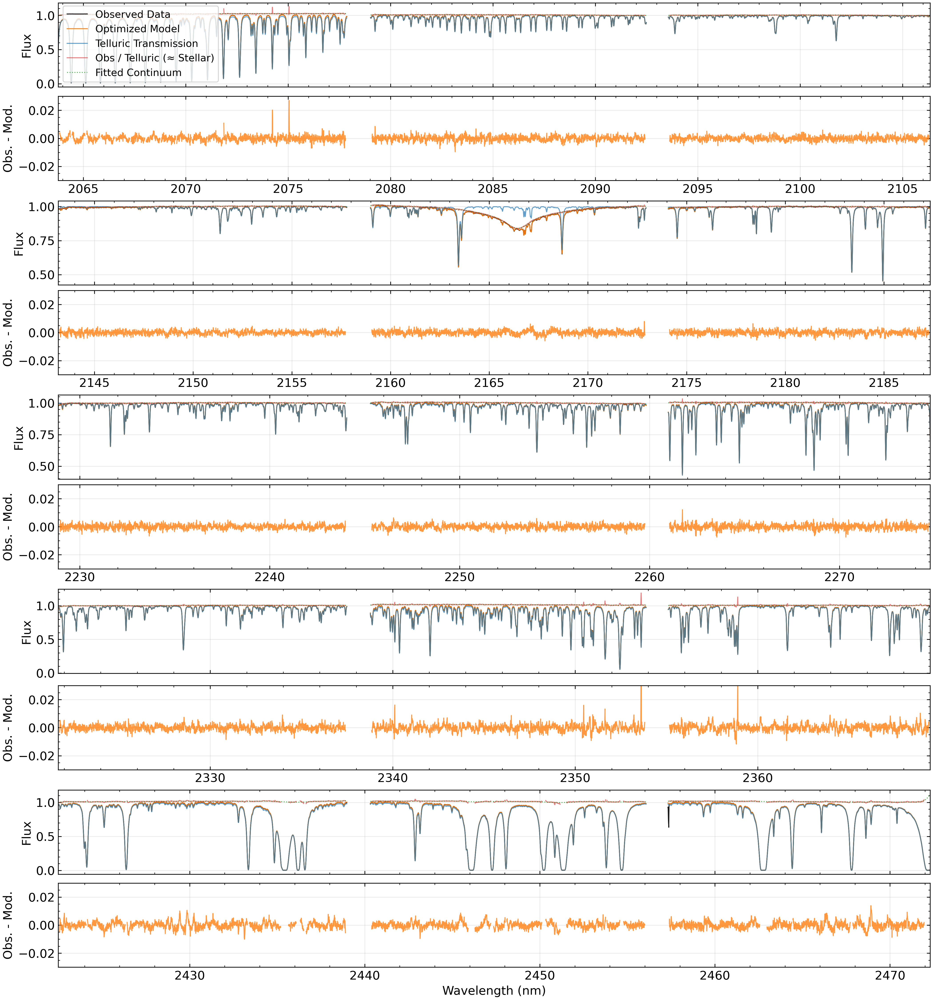
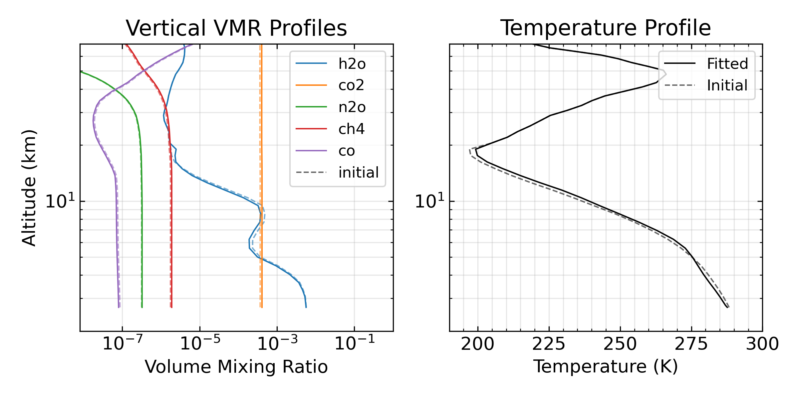
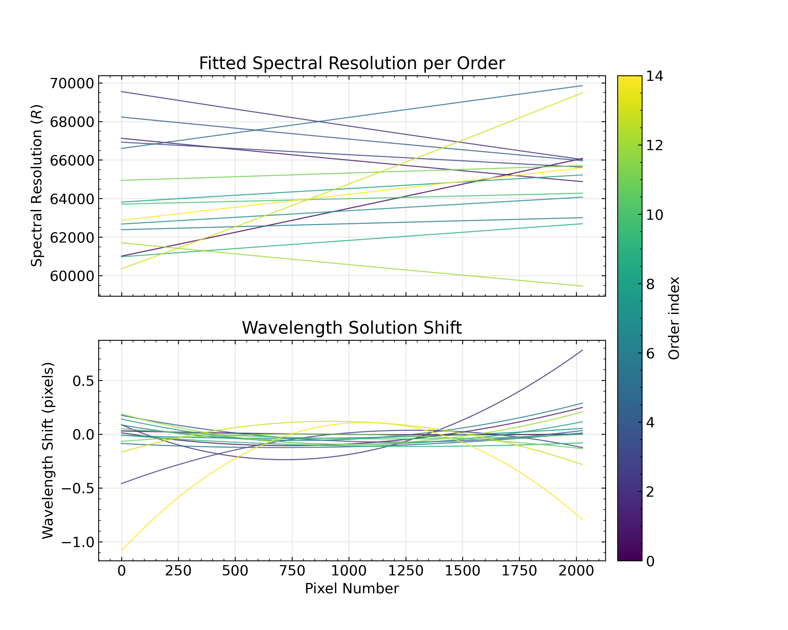
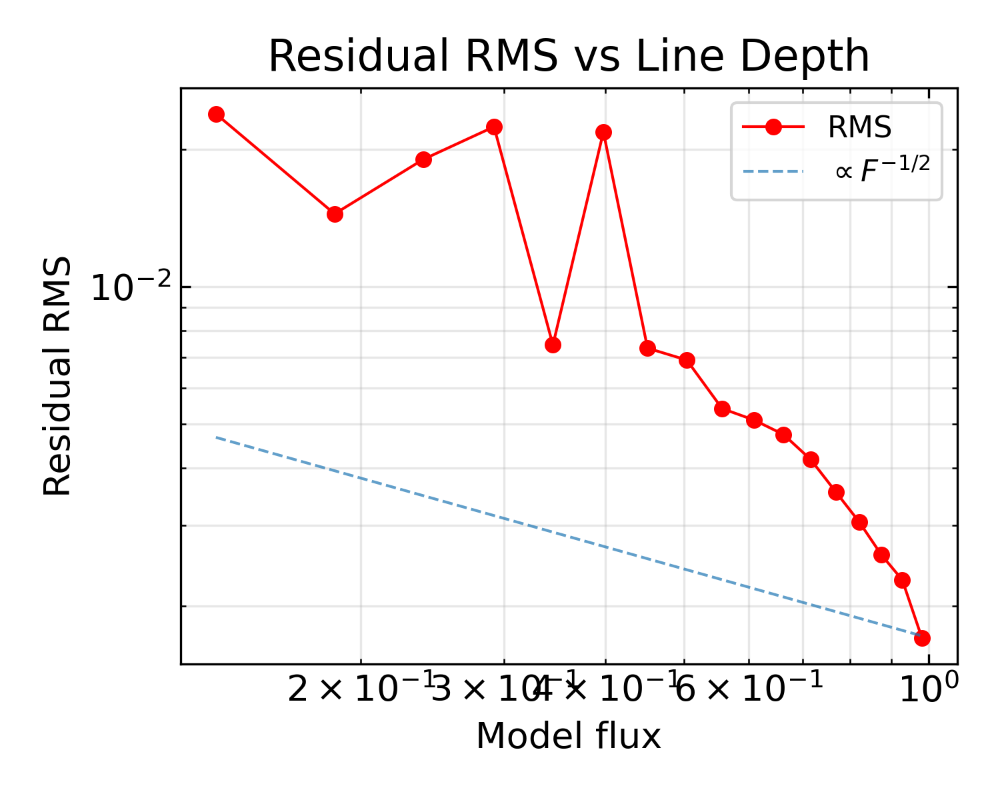
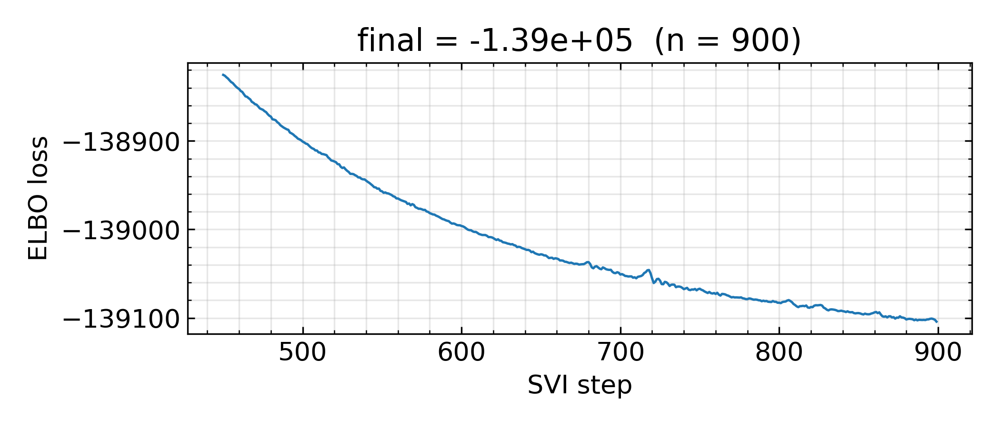
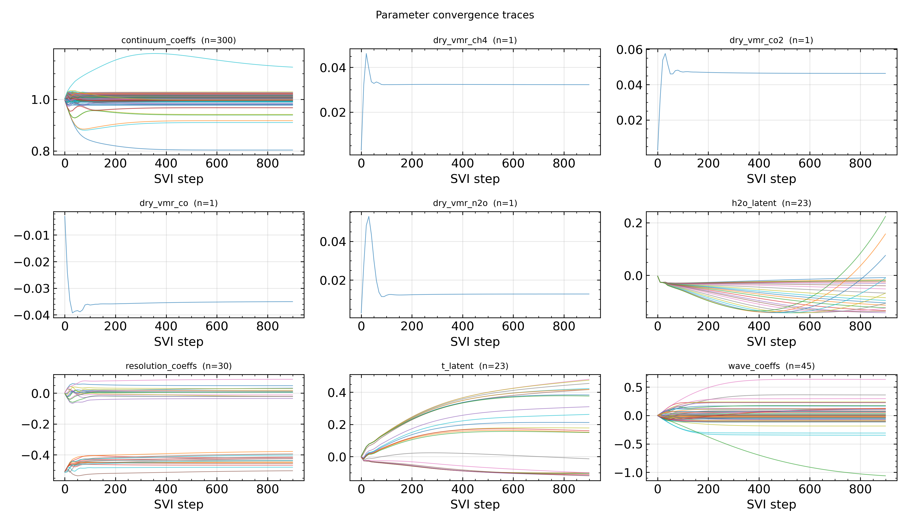
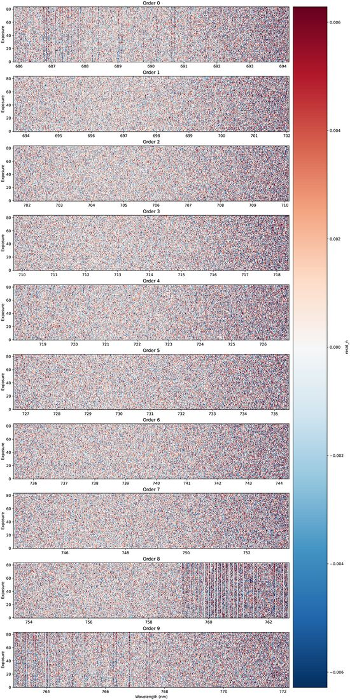
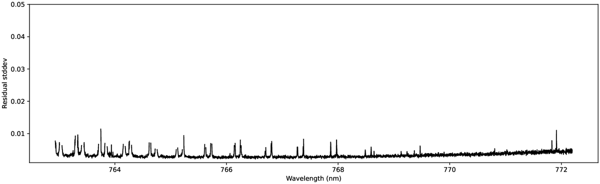
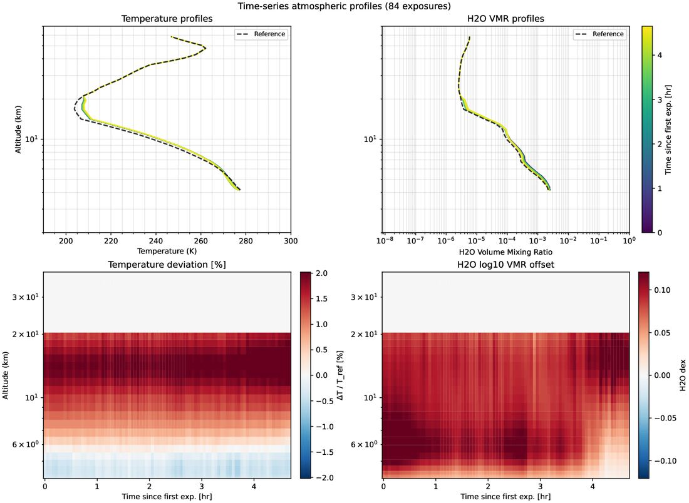
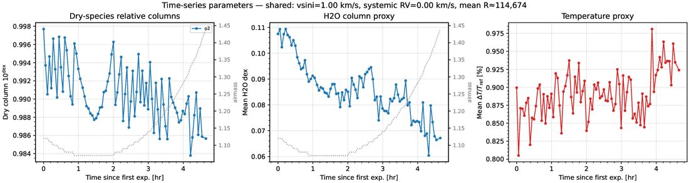

.. _outputs:

Interpreting the outputs
########################

Both :func:`~enuma.inference.fit.fit_spectrum` and :func:`~enuma.inference.fit.fit_timeseries` return a
:class:`~enuma.inference.fit.FitResult`. This page explains what it contains, what the fitted
parameters mean, the files written to disk, and how to read the diagnostic plots.

The fit result
**************

:class:`~enuma.inference.fit.FitResult` is a named tuple with these fields:

.. list-table::
   :header-rows: 1
   :widths: 20 80

   * - Field
     - Content
   * - ``params``
     - Best-fit parameters as a :class:`~enuma.state.ModelParameters` (see below).
   * - ``sites``
     - The same values as a flat dict, e.g. ``{"t_latent": ..., "dry_vmr_co2":
       ..., "wave_coeffs": ...}``. Convenient for saving with ``np.savez``.
   * - ``losses``
     - Loss (negative ELBO) at every optimiser step.
   * - ``data``, ``obs_mask``
     - The input data dict, and the pixel mask actually used (loader mask minus
       saturated pixels).
   * - ``context``, ``config``
     - Model context (grids, opacities, reference atmosphere) and static model
       configuration. Pass them with ``params`` to
       :func:`~enuma.model.forward.forward_model` to recompute the model.
   * - ``fit_config``
     - The :class:`~enuma.config.FitConfig` used.
   * - ``dry_species``, ``layout``
     - Dry species with a column parameter, and the per-exposure layout
       (``layout.n_exp`` exposures; ``layout.per_exposure`` lists the parameters
       fitted per exposure).
   * - ``param_history``
     - Parameter traces over the optimisation, used by the convergence plot.

To recompute the best-fit model:

.. code-block:: python

    from enuma import forward_model, forward_model_batched
    from enuma.model.forward import telluric_only

    # for single exposure: (O, P)
    model = forward_model(result.params, result.context, result.config)          
    transmission = telluric_only(result.params, result.context, result.config)

    # for time series: (N, O, P)
    model = forward_model_batched(res.params, res.context, res.config, res.layout)

``telluric_only`` returns the pure telluric transmission (no continuum, no star).
Dividing the observed spectrum by it gives the telluric-corrected spectrum.

Fitted parameters
*****************

``result.params`` holds the following fields. For a single exposure the shapes are
as listed; in a time series, parameters fitted per exposure carry an extra
leading ``(N,)`` axis.

.. list-table::
   :header-rows: 1
   :widths: 22 18 60

   * - Field
     - Shape
     - Meaning
   * - ``t_latent``
     - ``(n_active,)``
     - Latent variables of the temperature-profile GP, one per layer below
       ``temp_gp_cutoff_z_km``. Unit-normal and not physical by themselves; expand
       them as shown below.
   * - ``h2o_latent``
     - ``(n_active,)``
     - Latent variables of the H2O-profile GP (below ``h2o_gp_cutoff_z_km``).
   * - ``dry_vmr_scalars``
     - ``{species: (1,)}``
     - log10 offset of each dry species' VMR profile from the MIPAS reference. A
       value of 0.05 means the column is 10\ :sup:`0.05` ≈ 1.12 times the reference.
   * - ``resolution_coeffs``
     - ``(O, n_resolution_coeffs)``
     - Per-order polynomial (highest degree first) for the resolving power,
       R(x) = 10\ :sup:`5` · exp(poly(x)), with x running from −1 to 1 across the
       order.
   * - ``wave_coeffs``
     - ``(O, n_wave_coeffs)``
     - Per-order polynomial for the wavelength-solution correction, in **pixels**,
       with x from −1 to 1 across the order.
   * - ``continuum_coeffs``
     - ``(O, continuum_n_nodes)``
     - Weights of the per-order cubic B-spline continuum (about 1 for normalised
       data).
   * - ``rv_systemic``
     - scalar
     - Systemic radial velocity of the star (km/s); used only with a stellar
       template.
   * - ``vsini``
     - scalar
     - Projected rotation velocity of the star (km/s); used only with a stellar
       template.

Physical atmospheric profiles
-----------------------------

The temperature and water-vapour profiles are encoded as GP latents. To get the
physical profiles on the model's layer grid, use
:func:`~enuma.model.forward.expand_tp_profiles` and
:func:`~enuma.model.forward.get_layer_properties`:

.. code-block:: python

    import numpy as np
    from enuma.model.forward import expand_tp_profiles, get_layer_properties

    ctx, p = result.context, result.params
    z_km = np.asarray(ctx.z_centers) / 1e5                  # layer altitudes (km)

    # dT_rel = ΔT/T_ref; t_K = T_ref·(1 + ΔT/T_ref); h2o_dex = log10 VMR offset
    dT_rel, t_K, h2o_dex = expand_tp_profiles(ctx, p)

    # pressure (Ba), temperature (K), air column (molecules/cm²), {species: VMR}
    pressure, t_K, air_col, vmr = get_layer_properties(ctx, p)

For a time series with per-exposure profiles, select one exposure first, e.g.
``p = res.params._replace(t_latent=res.params.t_latent[i],
h2o_latent=res.params.h2o_latent[i])``.

Saved files
***********

:func:`~enuma.inference.fit.fit_spectrum` writes two files (paths set by
``save_params_json_path`` and ``save_spectrum_txt_path``):

``best_fit.json``
    The species list and every field of ``params``, as nested lists:

    .. code-block:: text

        {
          "species": ["h2o", "co2", ...],
          "params": {
            "t_latent": [...], "h2o_latent": [...],
            "dry_vmr_scalars": {"co2": [0.047], ...},
            "resolution_coeffs": [[...], ...], "wave_coeffs": [[...], ...],
            "continuum_coeffs": [[...], ...],
            "rv_systemic": 0.0, "vsini": 1.0
          }
        }

    Load it with :func:`~enuma.io.results.load_best_fit_params_json`. To recompute the model
    in a new session, rebuild the context from the same data and ``FitConfig``:

    .. code-block:: python

        from enuma import build_context, forward_model, load_best_fit_params_json

        params = load_best_fit_params_json("best_fit.json")
        context, config = build_context(data, fit_config)
        model = forward_model(params, context, config)

    The CLI ``plot`` command does this and redraws the diagnostic plots.

``best_fit.txt``
    Three columns, all orders concatenated:
    ``wavelength_nm``, ``flux_model`` (full model: telluric × continuum, × star if
    enabled) and ``flux_telluric`` (telluric transmission only).

:func:`~enuma.inference.fit.fit_timeseries` writes nothing; see :ref:`timeseries` for saving
its results.

Diagnostic plots
****************

``result.plot(output_dir)`` writes a set of PDFs. The figures below come from
fits of the example data: the CRIRES+ spectrum of :example:`quick_start.py` for a
single exposure, and the KELT-9 night of :example:`fit_kelt9_timeseries.py` for a
time series (here with the O2 column fitted per exposure).

Single exposure fit
-------------------

**fit_results.png**: the spectrum and residuals of every order. The flux panels
overlay the observation, the full model, the telluric transmission, the fitted
continuum, and the observation - model residuals.

**fit_results_profiles.png**: the initial (dashed) and fitted (solid)
VMR and temperature profiles versus altitude.

**fit_instrument.png**: the fitted resolving power R and the wavelength
shift (in pixels) across each order. A smooth, consistent R across orders and
sub-pixel shifts are expected; large excursions usually come from orders with
few lines.

**fit_residuals_diagnostic.png**: the RMS of the relative residuals
(observed / model − 1) binned by model flux, from deep lines on the left to the
continuum on the right. The dashed line is the photon-noise scaling
∝ F\ :sup:`−1/2`, anchored at the continuum. Residuals following it mean the fit
is noise-limited. A uniform excess at all depths points to noise, continuum or
wavelength-solution errors. Pass ``result.plot(out,
comparison_fits="other_model.fits")`` to compare against another model (e.g. molecfit)
as the black curve.

**fit_loss_history.png**: the loss over the second half of the optimisation.
It should flatten out; if it is still falling at ``max_steps``, increase
``max_steps``.

**fit_param_convergence.png**: one panel per fitted parameter group, one line
per component. Converged components have flat tails. A component that keeps
drifting (e.g. the wavelength zero point of a line-poor order) is poorly
constrained; consider pinning it or reducing the polynomial degree.

Time series fit
---------------

**residuals.png**: for each order, an image of the residuals with exposures
on the vertical axis and wavelength on the horizontal axis. Each pixel shows
the observed / model ratio over the night. 

**residuals_std.png**: the standard deviation of those residuals over the
night, versus wavelength.

**profiles.png**: top, the fitted temperature and H2O profiles of every
exposure (coloured by time) with the reference (dashed). Bottom, the deviation
from the reference (ΔT/T in %, H2O in dex) as altitude × time maps, up to the
GP cut-off altitude.

**parameters.png**: key parameters versus time. The panels show the dry-species
column scale factors, a water-vapour proxy (mean H2O dex offset in the sensitive
layers) and a temperature proxy (mean ΔT/T), with airmass overlaid (dotted).

